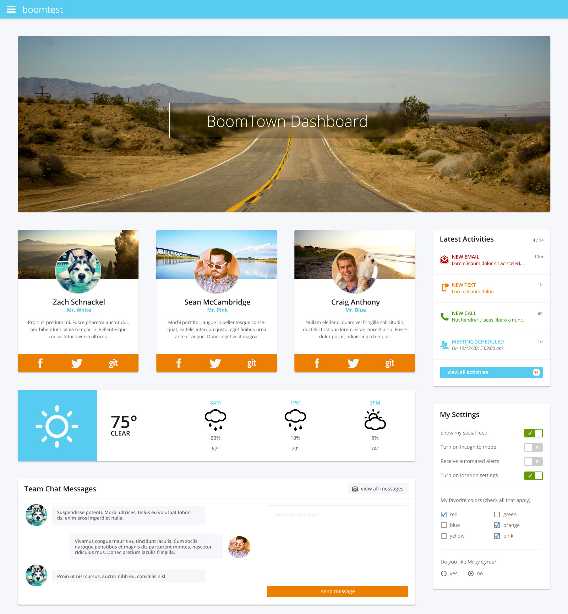
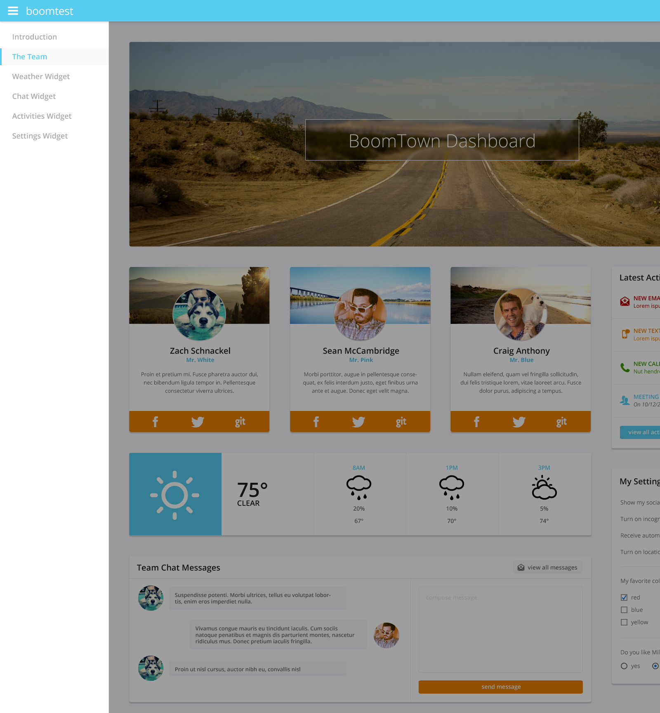

#BoomTown Front-End Developer Test

##Candidate Name: Chau Nguyen
##Project Started: November 17th 2014 4:28PM

## Task
The design team just put their finishing touches on the new "BoomTown Dashboard" interface. Now it's your turn. You are tasked with building the dashboard in a responsive / adaptive, "mobile first" fashion.

You'll notice that the design team only provided you with a desktop version of the dashboard. Therefore, you have full creative freedom to handle break points as you see fit. You also have full creative freedom to include tasteful interactions and animations.

Once given access to this repo, you have **1 week** to complete this project. Any commits to your repo after that will not be accepted.

## Assets
This repo contains an `assets/` directory which contains all necessary assets to build the BoomTown Dashboard.

* `project.png`: Screen shot of the BoomTown Dashboard.
* `project-navigation.png`: Screen shot of the off-canvas navigation.
* `images/`: Raw image assets.
* `icons/`: SVG assets for iconography. Use them however you like.

## Tools
We expect all candiates to use the following:

* [Bower](http://www.bower.io) to install project dependencies. 
* [NPM](https://www.npmjs.org/) to install packages used for build tasks.
* [Gulp](http://gulpjs.com/) or [Grunt](http://gruntjs.com/) to write project build tasks.
* [LESS](http://lesscss.org/) or [SASS](http://sass-lang.com/) (we prefer LESS).
* A CSS/JS framework like [Bootstrap](http://getbootstrap.com/), [UIkit](http://getuikit.com), or [Foundation](http://foundation.zurb.com/) to demonstrate your understanding of frameworks and your ability to integrate the framework in your project’s build process.
* [GitHub](http://github.com) as your Git repo hosting service.
* [GitHub Pages](https://pages.github.com/) to demo your completed project.

## Requirements
A few odds 'n ends that make us happy.

* It’s 2014, use HTML5.
* It’s also still 2011 for some folks. Be sure IE9 users get at least a C-grade experience. Use any polyfills you deem necessary. Progressive enhancement is your friend. 
* Make it responsive or adaptive. Actual breakpoints are up to you.
* Write CSS and HTML in a modular, scalable fashion. 
* Be consistent with spacing/indenting in your code and naming conventions across your project’s assets.
* Generated CSS and Javascript files should be compressed/minimized/optimized.
* Only use the provided image assets. These may be used to create additional assets if necessary - such as a sprite. They may also be cropped and compressed.
* You are required to push ALL source files to your repo. Anything used to build the dashboard should be included.

## Final Thoughts
We aren’t looking for pixel perfect design, but do expect attention to detail. We want to see how you approach the challenge and execute the finished product. Cheers!

## Screens

